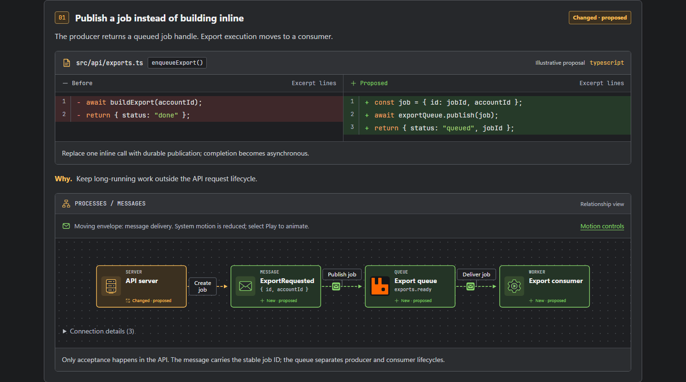
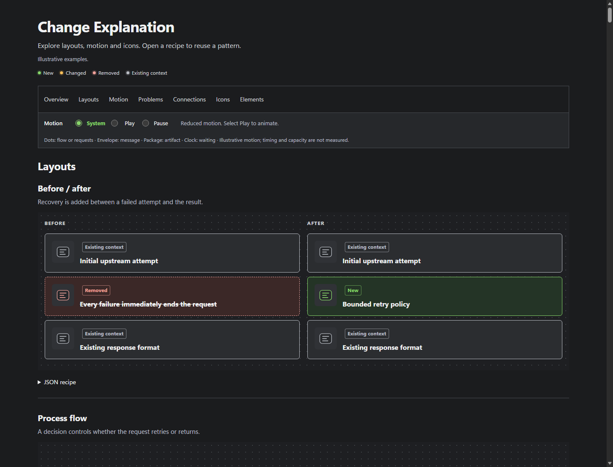

# ouat

Self-contained HTML explanations of actual changes and proposed solutions, with concise summaries, focused evidence, and directly labeled diagrams when useful.



## Use the skill

Copy the complete `change-explanation/` folder into your agent's skills directory. Invoke it explicitly:

```text
Use $change-explanation to explain the changes between main and this branch.
Use $change-explanation to propose moving scheduled exports into a worker.
```

Ordinary explanation requests do not activate the skill. `review` explains an inspected comparison; `plan` explains one proposal with labeled assumptions. A defect audit is a separate request.

The agent records scope and source revisions, validates JSON, and delivers HTML plus its source JSON. Reports embed their assets and open locally without a server. Source links identify their lines and revisions; local file links open the current working copy.

## Try the examples

Use Python 3.12; the renderer and tests use only the standard library.

```sh
python change-explanation/scripts/report.py validate change-explanation/assets/example-system.json
python change-explanation/scripts/report.py render change-explanation/assets/example-system.json --output reports/my-explanation.html
```

Open the HTML in a browser. Use `--force` only to replace your own output.

- [Documentation review](reports/example-review.html) · [JSON](change-explanation/assets/example-review.json): a pinned historical change without a diagram.
- [Retry proposal](reports/example-plan.html) · [JSON](change-explanation/assets/example-plan.json).
- [Worker proposal](reports/example-system.html) · [JSON](change-explanation/assets/example-system.json).

The proposals are hypothetical. The documentation review does not verify runtime behavior.

## Explore the showcase



Open [the showcase](docs/showcase.html) locally to explore problem stories, layouts, icons, and motion. Expand a question to see its mechanism and JSON recipe. On GitHub, download the HTML first.

```sh
python change-explanation/scripts/report.py showcase --output docs/showcase.html --force
```

System/Play/Pause controls motion; essential information remains available without animation and in print. Individual logo licenses and trademark terms apply; see [brand notices](change-explanation/assets/brands/NOTICE.txt).

## Verify

```sh
python -m unittest discover -s change-explanation/scripts -p "test_*.py" -v
node change-explanation/scripts/preview_check.mjs reports/my-explanation.html reports/previews "/path/to/chrome"
```

The optional browser helper needs Node 22+ and local Chrome or Edge. Structural and visual checks do not establish factual accuracy.

Authoring references: [format](change-explanation/references/format.md), [visual checks](change-explanation/references/rendering.md), and [schema](change-explanation/assets/report.schema.json).
